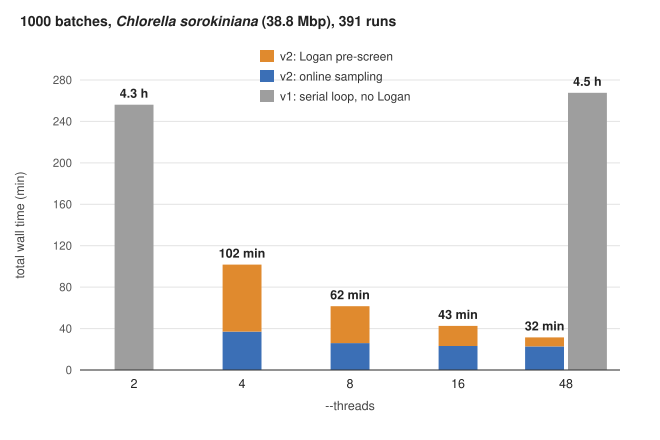

<p align="center">
  
</p>

$${\color{lightgray}\scriptsize\text{Logo generated with Google Gemini.}}$$

Authors: Lars Gabriel & Katharina J. Hoff, University of Greifswald, Germany

**pyVARUS** automates the selection and download of a limited number of
RNA-seq reads or long transcriptome reads from NCBI's Sequence Read Archive 
(SRA; Katz et al., 2022, [DOI:10.1093/nar/gkab1053](https://doi.org/10.1093/nar/gkab1053)), 
targeting a sufficiently high coverage of many genes for the annotation of 
protein coding genes in eukaryotic genomes.

pyVARUS is a major overhaul of
[VARUS](https://github.com/Gaius-Augustus/VARUS) (Stanke et al., 2019,
[DOI:10.1186/s12859-019-3182-x](https://doi.org/10.1186/s12859-019-3182-x)).
It keeps the core ideas of VARUS (greedy online sampling, coverage tiles, 
spliced junction hints) but has been sped up by orders of magnitude, made 
more robust, and extended to long-read RNA-seq. A pre-screen of candidate runs with 
[Logan](https://github.com/IndexThePlanet/Logan) (Chikhi et al.,
2024, [DOI:10.1101/2024.07.30.605881](https://doi.org/10.1101/2024.07.30.605881))
increases the yield of downloaded reads and reduces wasted downloads. The
entire pipeline can be run with a single command, and a
[Nextflow](https://www.nextflow.io/) (Di Tommaso et al., 2017,
[DOI:10.1038/nbt.3820](https://doi.org/10.1038/nbt.3820)) wrapper is
provided for batch processing of multiple species.

## Installation

### Container (recommended)

The container contains pyVARUS and all required dependencies, so nothing
else needs to be installed: HISAT2 (Kim et al., 2019,
[DOI:10.1038/s41587-019-0201-4](https://doi.org/10.1038/s41587-019-0201-4)),
minimap2 (Li, 2018,
[DOI:10.1093/bioinformatics/bty191](https://doi.org/10.1093/bioinformatics/bty191)),
SAMtools (Danecek et al., 2021,
[DOI:10.1093/gigascience/giab008](https://doi.org/10.1093/gigascience/giab008)),
[sra-tools](https://github.com/ncbi/sra-tools) and zstd. Use
Singularity/Apptainer:

```sh
singularity pull pyvarus.sif docker://gaiusaugustus/pyvarus:latest
singularity exec pyvarus.sif varus --help
```

Prefix every `varus ...` command in this README with
`singularity exec pyvarus.sif`. Singularity mounts your home directory by
default, so the [NCBI cache setting](#disable-the-ncbi-cache) applies
inside the container too.

Or use Docker (the entry point is `varus`, so pass the subcommand directly):

```sh
docker run --rm -v "$PWD":/data -w /data gaiusaugustus/pyvarus:latest --help
```

### Conda

If you do not have conda yet, install
[Miniforge](https://github.com/conda-forge/miniforge):

```sh
curl -L -O "https://github.com/conda-forge/miniforge/releases/latest/download/Miniforge3-$(uname)-$(uname -m).sh"
bash Miniforge3-$(uname)-$(uname -m).sh
```

Create an environment with all external tools (and `pysam`, so it does not
have to be compiled), then install pyVARUS into it:

```sh
conda create -n pyvarus -c conda-forge -c bioconda \
    python=3.11 hisat2 minimap2 "samtools>=1.17" sra-tools zstd pysam
conda activate pyvarus

git clone https://github.com/Gaius-Augustus/pyVARUS.git
cd pyVARUS
pip install -e ".[align]"   # add ',dev' for the test suite
varus --help
```

### Disable the NCBI cache

Whichever way you install, disable the sra-toolkit cache once so batch
downloads do not silently fill `~/.ncbi/public/sra/`:

```sh
mkdir -p ~/.ncbi
echo '/repository/user/cache-disabled = "true"' >> ~/.ncbi/user-settings.mkfg
```

### Other installation methods

Installing without container or conda (distro packages, plain `pip`, the
list of external tools and what needs them) is described in
[docs/manual_install.md](docs/manual_install.md).

## Quick start

Three commands:

```sh
# 1. Query NCBI SRA for all RNA-seq runs of the species
varus runlist "Schizosaccharomyces pombe" --outdir Sp/ --email you@host

# 2. Build a HISAT2 index of the genome
varus index   genome.fa --outdir Sp/genome/ --threads 8

# 3. Run the Logan pre-screen and the online sampling loop
varus run     "Schizosaccharomyces pombe" genome.fa \
              --runlist Sp/Runlist.tsv          \
              --index   Sp/genome/hisatidx      \
              --max-batches 1000 --threads 8    \
              --outdir  Sp/
```

`varus run` first screens the candidate runs by their Logan contigs (see
[Logan pre-screen](#logan-pre-screen-varus-logan)) and then samples reads.
Outputs in `Sp/`:

| File | Contents |
|---|---|
| `logan/`, `Runlist.logan.tsv` | Logan pre-screen: per-run ranking, contig introns, filtered runlist |
| `VARUS.bam` | merged coordinate-sorted alignment of all sampled batches (aligned reads only) |
| `introns.gff` | cumulative spliced-junction hints (strand `.`; the strand-resolved set feeds `intronDB.splice_sites`) |
| `Coverage.csv` | UMR count per 5 kb tile |
| `RunStatistics.csv` | per-run summary (downloads, UMR%, bad-quality flag) |
| `BatchTimings.tsv` | per-batch wall time by phase (download, align, scan, DB, estimator) |

### Options

`varus run --help` lists the options every user may need; `--help-all` adds
the expert options below.

| Flag | Default | Notes |
|---|---|---|
| `--runlist`, `--index` | required | from `varus runlist` and `varus index` |
| `--outdir` | cwd | output directory; the Logan pre-screen writes `<outdir>/logan/` |
| `--threads` | 4 | total CPU budget; pyVARUS splits it between the stages that run at once (see [Threads and machine size](#threads-and-machine-size)) |
| `--max-batches` | 1000 | hard upper bound on download iterations |
| `--seed` | random | random seed for a reproducible run order |
| `--longreads` | off | align with minimap2 (long-read RNA-seq); see [below](#long-read-rna-seq---longreads) |
| `--no-logan` | off | skip the Logan pre-screen (see [below](#logan-pre-screen-varus-logan)) |

#### Expert options (`varus run --help-all`)

Sampling parameters. The defaults are those of the VARUS paper and of the
benchmarks in [`docs/benchmark_logan.md`](docs/benchmark_logan.md); changing
them changes what is sampled.

| Flag | Default | Notes |
|---|---|---|
| `--batch-size` | 50000 / 2000 | reads per batch (short / `--longreads`) |
| `--tile-size` | 5000 | bp per coverage tile |
| `--min-uniq-pct` | 5.0 | reject batches below this UMR % (low-quality alignment) |
| `--min-mapq` | 60 / 1 | uniqueness MAPQ cutoff (short / `--longreads`) |
| `--bootstrap-all` | off | seed one batch from every run before the greedy loop (v1 `--loadAllOnce`) |
| `--profit-condition` | off | stop early when expected marginal gain <= 0 (never fired in the benchmarks) |
| `--advanced KEY=VALUE` | -- | estimator hyperparameters: `lambda=3`, `pseudo-count=0.1`, `cost=0` (v1: `lambda=10`, `pseudo-count=1`) |
| `--keep-batches` | off | retain per-batch FASTA/BAM after counting |
| `--coverage-trace N` | 0 (off) | snapshot Coverage every N batches |

Speed knobs. None of them changes what is sampled, except
`--parallel-downloads 1`, which reproduces the serial v1 loop.

| Flag | Default | Notes |
|---|---|---|
| `--parallel-downloads K` | 6 | keep K batch downloads in flight; picks account for in-flight batches (see [Speed-ups](docs/speedups.md)); 1 = strictly serial v1 loop and pick sequence |
| `--merge-batches N` | 10 | fetch up to N consecutive batches of a run in one download while greedy selection would pick that run again anyway (1 = off; not used with `--parallel-downloads 1`) |
| `--scan-workers N` | auto | scan merged batches by genome region in N processes (identical counts; 0 or 1 = one pass). Default `--threads`/8, at most 4, none below 16 threads |
| `--merge-every N` | 100 | merge batch BAMs in the background every N accepted batches (0 = one final merge) |
| `--splice-db-min-mult N` | 1 | only junctions seen ≥ N times enter the aligner's splice-site DB |

Logan options of `varus run`. The pre-screen's own options (candidate count,
gates, weights) belong to `varus logan`; run it as a separate step to set
them.

| Flag | Default | Notes |
|---|---|---|
| `--logan-dir DIR` | `<outdir>/logan` | use an existing `varus logan` output instead of running the pre-screen |
| `--logan-top K` | 0 (all) | restrict the loop to the K best-ranked runs |
| `--logan-keep-unprocessed` | off | also sample the runs Logan could not process (newer than the last Logan rebuild, or not among the screened candidates). By default only accepted runs are sampled, unless they hold fewer batches than `--max-batches` |
| `--logan-prior-batches B` | 1 | weight of the Logan prior in batch equivalents (0 = seed the splice DB only) |
| `--logan-merge-introns` | off | include Logan contig introns in the final `introns.gff` |

`varus run` exits with status **3** when no batch passed the quality gate
(no `VARUS.bam` is written). Wrappers should treat this as "no usable
RNA-seq", not as a crash. Per-batch phase timings are written to
`BatchTimings.tsv`.

### Threads and machine size

Set `--threads` to the number of cores the job owns (under SLURM,
`$SLURM_CPUS_PER_TASK`) for both `varus logan` and `varus run`. Nothing else
has to change with the machine: pyVARUS splits the budget between the stages
that run at the same time and logs the split in its `Thread budget` line
([how it is split](docs/speedups.md#threads-and-machine-size)).

What to expect with the Logan pre-screen on a 38.8 Mbp algal genome
(*Chlorella sorokiniana*, 391 candidate runs, 1000 batches):



The gray bars are v1 on the same genome. Its serial loop waits for one
download at a time, so more threads do not help: 4.3 h with 2 threads,
4.5 h with 48.
The Logan stage is limited by CPU and grows with genome size and the number
of screened runs (mouse, 2.7 Gb: 76 min at 48 threads). The online sampling
is limited by downloads and takes 14–25 min at 48 threads on every benchmark
genome, so more than 48 threads does not make a run faster. The results are
the same at every thread count. Each minimap2 process loads its own copy of
the index; pass `--align-groups 1` on a shared node. Network limits and
memory rules: [Speed-ups](docs/speedups.md#what-limits-a-run).

### Logan pre-screen (`varus logan`)

[Logan](https://github.com/IndexThePlanet/Logan) provides an assembly
(contigs, k = 31) of nearly every public SRA run.
Aligning a run's contigs (3–5 MB compressed) to the genome takes seconds and
already tells pyVARUS which genome tiles that run expresses, which runs are
from the wrong organism, and which splice junctions it supports. The
pre-screen is **on by default**: `varus run` runs it for every candidate run
*before* any reads are downloaded, writes `<outdir>/logan/` and
`<outdir>/Runlist.logan.tsv`, and reuses an existing `<outdir>/logan/` on a
rerun. `--no-logan` skips it. To set the pre-screen's own options (candidate
count, gates, weights), run it as a separate step; `varus run` then picks
up its output:

```sh
varus logan genome.fa --runlist Sp/Runlist.tsv --outdir Sp/ --threads 8 \
            --max-candidates 1000
varus run   "Schizosaccharomyces pombe" genome.fa --runlist Sp/Runlist.tsv \
            --index Sp/genome/hisatidx --outdir Sp/ --threads 8   # finds Sp/logan/
```

`--logan-dir` points `varus run` at a pre-screen stored elsewhere.

What it does:

1. samples up to `--max-candidates` (500) runs, round-robin over
   BioProjects, and checks Logan availability with HTTP `HEAD` (cached);
2. streams the contigs over `--download-workers` (8) connections, aligns
   them with `minimap2 -ax splice --secondary=no` in chunks of
   `--chunk-runs` (25) runs, and records per run the 5-kb tiles covered and
   the introns found (weighted by the contigs' `ka:f` abundance, capped).
   Each chunk is split into `--align-groups` minimap2 processes (one per
   ~15 threads, 1–4; 3 at 48 threads) whose output is piped straight into
   their own scanner processes, so nothing is sorted or written to disk
   unless `--logan-bam` asks for the chunk BAMs (fewer groups if the index
   copies would not fit in memory);
3. rejects runs whose contigs cover fewer than `--min-tiles-frac` (10 %) of
   the tiles of the best run (foreign organisms, empty runs) or whose contigs
   diverge from the genome by more than `--max-divergence` (median minimap2
   `de`, default 0.05: other species of the same genus still cover the genome
   with minimap2, but HISAT2 maps under 5 % of their reads), and estimates
   each run's *yield* (fraction of abundance × length contig mass that maps;
   mixed or contaminated samples score low even when their coverage is broad);
4. ranks the accepted runs by greedy maximisation of the VARUS score
   Σ log(1 + c_j), each run weighted by its yield, and writes
   `Runlist.logan.tsv` (rejected runs removed, ranked runs first),
   `logan/LoganRanking.tsv`, `logan/logan_introns.gff` and a seed
   splice-site DB.

`varus run` then drops rejected runs, seeds `intronDB` before the first
batch, gives the first picks to the ranked runs in rank order (without this
the cold-start shared prior out-scores every informative profile), and gives
every accepted run an estimator prior worth `--logan-prior-batches` (1) real
batches with its expected read count scaled by the yield. `--logan-top K`
restricts the loop to the K best-ranked runs. Logan is rebuilt in full at
discrete time points, so runs newer than the last rebuild, and runs beyond
`--max-candidates`, are "unprocessed". By default the loop samples only the
accepted runs (the best Logan configuration in the benchmarks: fewest
rejected batches, same score). The unprocessed runs are kept as well when
the accepted runs cannot fill the run, i.e. when they hold fewer batches of
`--batch-size` spots than `--max-batches` (species with few runs in Logan),
and always with `--logan-keep-unprocessed`; they then stay eligible with the
shared prior, their expected read count discounted by the gate's acceptance
rate. `varus logan` exits 3 when no run is accepted and 4 when the bucket is
unreachable. When `varus run` runs the pre-screen itself, exit 3 drops the
rejected runs and samples the unprocessed ones without a prior, and exit 4
continues without the pre-screen.

Requirements: `minimap2` on `PATH` (the `zstandard` package is installed
with pyVARUS; the `zstd` binary works as a fallback).

### Long-read RNA-seq (`--longreads`)

PacBio Iso-Seq and ONT direct-RNA runs from SRA are aligned with `minimap2 -ax splice`
instead of HISAT2. The same online algorithm runs on top -- only the alignment, the
splice-DB feedback format, and a few defaults change.

```sh
# 1. Restrict the SRA query to long-read platforms (PacBio + ONT).
varus runlist "Schizosaccharomyces pombe" --outdir Sp/ --email you@host --longreads

# 2. Build a minimap2 splice index instead of HISAT2.
varus index   genome.fa --outdir Sp/genome/ --threads 8 --longreads

# 3. Run with --longreads. The default --batch-size drops from 50000 to 2000
#    because long-read SRA runs have far fewer spots. The minimap2 preset
#    (Iso-Seq vs ONT direct-RNA) is auto-selected per run from the platform
#    column of Runlist.tsv.
varus run     "Schizosaccharomyces pombe" genome.fa     \
              --runlist Sp/Runlist.tsv                  \
              --index   Sp/genome/mm2idx.mmi            \
              --longreads                               \
              --max-batches 1000 --threads 8 --outdir Sp/
```

Differences vs the HISAT2 path:

- `--index` points at the `.mmi` *file* rather than a stem. The Logan
  pre-screen aligns the contigs against this index.
- `Runlist.tsv` has a `platform` column (e.g. `PACBIO_SMRT`, `OXFORD_NANOPORE`)
  parsed from the SRA `<Instrument>` tag, next to the `bioproject` column the
  Logan pre-screen samples over. The controller maps it to the minimap2
  preset per run (`PACBIO_SMRT` -> `-ax splice`; `OXFORD_NANOPORE` -> `-ax splice -uf -k14`).
  Old 6-column runlists still load (platform falls back to empty + a warning).
- The splice-DB written each round is `intronDB.junc.bed` (BED12 for `minimap2 --junc-bed`)
  instead of `intronDB.splice_sites` (HISAT2 tab format).
- The uniqueness % is computed by scanning the BAM (primary, MAPQ >= `--min-mapq`),
  not parsed from a HISAT2-specific log file.

### Nextflow

A standalone Nextflow pipeline lives in [`nextflow/`](nextflow/):

```sh
nextflow run nextflow/main.nf \
  -c nextflow/example.config \
  --species_csv mycsv.csv \
  --outdir results \
  --ncbi_email you@host
```

`mycsv.csv` is a 2-column CSV: `species,genome` (one row per species). The
pipeline runs `VARUS_RUNLIST`, `VARUS_INDEX`, `VARUS_LOGAN` (skipped with
`--varus_logan false`) and `VARUS_RUN` in sequence per species.

#### Nextflow params

| Param | Default | Notes |
|---|---|---|
| `--species_csv` | required | 2-column CSV: `species,genome` |
| `--outdir` | `results` | output root |
| `--ncbi_email` | -- | contact email for NCBI Entrez (recommended) |
| `--ncbi_api_key` | -- | raises NCBI rate limit to 10 req/s |
| `--varus_max_batches` | 1000 | passed to `varus run --max-batches` |
| `--varus_batch_size` | 50000 | passed to `varus run --batch-size` |
| `--varus_tile_size` | 5000 | passed to `varus run --tile-size` |
| `--varus_min_uniq_pct` | 5.0 | passed to `varus run --min-uniq-pct` |
| `--varus_max_runs` | 0 (all) | passed to `varus runlist --max-runs` |
| `--varus_seed` | 1 | passed to `varus run --seed` |
| `--varus_bootstrap_all` | false | passed to `varus run --bootstrap-all` |
| `--varus_profit_condition` | false | passed to `varus run --profit-condition` |
| `--varus_parallel_downloads` | 6 | passed to `varus run --parallel-downloads` |
| `--varus_merge_every` | 100 | passed to `varus run --merge-every` |
| `--varus_logan` | true | run `VARUS_LOGAN` and pass `--logan-dir` to `varus run`; `false` skips the pre-screen |
| `--varus_logan_cpus`, `--varus_logan_max_candidates`, `--varus_logan_select_top`, `--varus_logan_top` | 8, 500, 50, 0 | Logan stage resources and selection |
| `--varus_index_cpus` | 8 | CPUs for `VARUS_INDEX` |
| `--varus_run_cpus` | 16 | CPUs for `VARUS_RUN` |
| `--longreads` | false | switch to minimap2 + restrict the SRA query to PacBio/ONT (preset auto-selected per run) |

`VARUS_RUN` publishes one additional file per species: `runtime.varus.txt`
(`/usr/bin/time -p` wall/user/sys report).

The module can be imported into a larger workflow:

```groovy
include { VARUS_RUNLIST; VARUS_INDEX; VARUS_LOGAN; VARUS_RUN } from '/path/to/pyVARUS/nextflow/varus.nf'
```

## Tests

```sh
pip install -e ".[align,dev]"
pytest
```

The BAM/intron tests are skipped automatically when `pysam` is not importable
(Windows without htslib).

## Citation

Please cite:
[VARUS: sampling complementary RNA reads from the sequence read archive](https://bmcbioinformatics.biomedcentral.com/track/pdf/10.1186/s12859-019-3182-x).
Stanke M., Bruhn W., Becker F., Hoff K. J. (2019). *BMC Bioinformatics*, 20:558.
[DOI:10.1186/s12859-019-3182-x](https://doi.org/10.1186/s12859-019-3182-x).

pyVARUS builds on the following resources and tools; please cite them as well:

- **Logan:** Chikhi R., Lemane T., Loll-Krippleber R., et al. (2024). Logan:
  planetary-scale genome assembly surveys life's diversity. *bioRxiv*
  (preprint).
  [DOI:10.1101/2024.07.30.605881](https://doi.org/10.1101/2024.07.30.605881).
- **SRA:** Katz K., Shutov O., Lapoint R., Kimelman M., Brister J. R.,
  O'Sullivan C. (2022). The Sequence Read Archive: a decade more of explosive
  growth. *Nucleic Acids Research*, 50(D1):D387–D390.
  [DOI:10.1093/nar/gkab1053](https://doi.org/10.1093/nar/gkab1053).
- **HISAT2:** Kim D., Paggi J. M., Park C., Bennett C., Salzberg S. L. (2019).
  Graph-based genome alignment and genotyping with HISAT2 and HISAT-genotype.
  *Nature Biotechnology*, 37(8):907–915.
  [DOI:10.1038/s41587-019-0201-4](https://doi.org/10.1038/s41587-019-0201-4).
- **minimap2:** Li H. (2018). Minimap2: pairwise alignment for nucleotide
  sequences. *Bioinformatics*, 34(18):3094–3100.
  [DOI:10.1093/bioinformatics/bty191](https://doi.org/10.1093/bioinformatics/bty191).
- **SAMtools:** Danecek P., Bonfield J. K., Liddle J., et al. (2021). Twelve
  years of SAMtools and BCFtools. *GigaScience*, 10(2):giab008.
  [DOI:10.1093/gigascience/giab008](https://doi.org/10.1093/gigascience/giab008).
- **Nextflow** (only for the Nextflow pipeline): Di Tommaso P., Chatzou M.,
  Floden E. W., Prieto Barja P., Palumbo E., Notredame C. (2017). Nextflow
  enables reproducible computational workflows. *Nature Biotechnology*,
  35(4):316–319. [DOI:10.1038/nbt.3820](https://doi.org/10.1038/nbt.3820).

## License

GPL-3.0-or-later. See [LICENSE](LICENSE).
