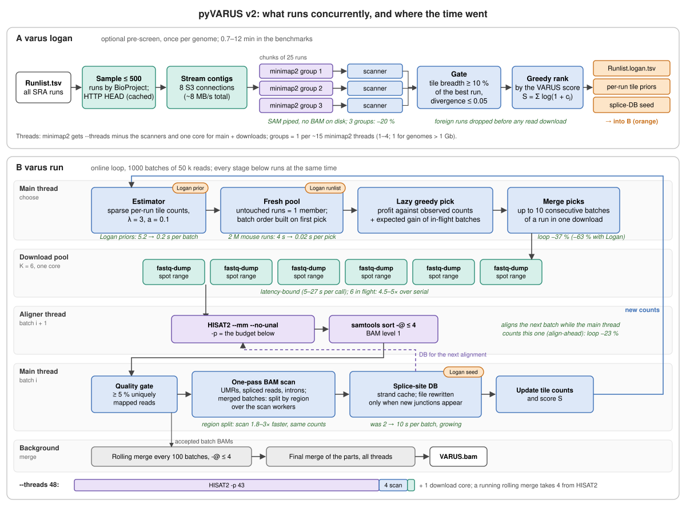

# VARUS: Drawing Diverse Samples from RNA-Seq Libraries

**VARUS** automates the selection and download of a limited number of RNA-seq
reads from NCBI's Sequence Read Archive (SRA) targeting a sufficiently high
coverage for many genes for the purpose of gene-finder training and genome
annotation. Each iteration of the online algorithm

- selects a run to download that is expected to complement previously
  downloaded reads,
- downloads a sample of reads ("batch") with **fasterq-dump**,
- aligns the reads with **HISAT2** (short reads) or **minimap2** (long reads),
- evaluates the alignment.

The algorithm is described in Stanke et al. (2019),
[DOI:10.1186/s12859-019-3182-x](https://doi.org/10.1186/s12859-019-3182-x).
This repository hosts the Python rewrite of the original C++/Perl
implementation; the v1 sources remain in the upstream
[Gaius-Augustus/VARUS](https://github.com/Gaius-Augustus/VARUS) repository.

## Installation

VARUS has two kinds of dependencies: Python packages (installed by `pip`)
and external command-line tools (installed by you, via conda / your distro
package manager).

### 1. External command-line tools (install manually)

These are *not* installed by `pip` and must be on `PATH` before you run VARUS.

| Tool | Used by | Required? |
|---|---|---|
| `hisat2`, `hisat2-build` | `varus index`, `varus run` (short reads) | required unless using `--longreads` |
| `minimap2` | `varus index --longreads`, `varus run --longreads` | required for long-read mode |
| `samtools` | `varus run` (sort, merge, index) | required |
| `fastq-dump`, `prefetch` ([sra-toolkit](https://github.com/ncbi/sra-tools)) | `varus run` (downloads from SRA; `prefetch` only with `--prefetch`) | required |
| `minimap2`, `zstd` | `varus logan` (contig alignment; `zstd` only if the `zstandard` package is missing) | optional |

Install via conda (recommended) -- one command covers all of them:

```sh
conda install -c bioconda hisat2 minimap2 samtools sra-tools
```

Or via your distro package manager (Ubuntu example):

```sh
sudo apt install hisat2 minimap2 samtools sra-toolkit
```

After installing sra-toolkit, disable the NCBI cache once on the host so
batch downloads do not silently fill `~/.ncbi/public/sra/`:

```sh
mkdir -p ~/.ncbi
echo '/repository/user/cache-disabled = "true"' >> ~/.ncbi/user-settings.mkfg
```

### 2. Python package

```sh
git clone <REPO_URL>
cd VARUS
pip install -e ".[align,logan]"   # add ',dev' for the test suite
```

The `[align]` extra pulls in `pysam` (needed by `varus run` for intron
extraction). It builds from source against `htslib` and only compiles on
Linux/macOS -- on Windows you can still install plain `pip install -e .`
to use the `runlist` and `index` subcommands.

## Quick start

Three commands:

```sh
# 1. Query NCBI SRA for all RNA-seq runs of the species
varus runlist "Schizosaccharomyces pombe" --outdir Sp/ --email you@host

# 2. Build a HISAT2 index of the genome
varus index   genome.fa --outdir Sp/genome/ --threads 8

# 3. Run the online sampling loop
varus run     "Schizosaccharomyces pombe" genome.fa \
              --runlist Sp/Runlist.tsv          \
              --index   Sp/genome/hisatidx      \
              --max-batches 1000 --threads 8    \
              --outdir  Sp/
```

Outputs in `Sp/`:

| File | Contents |
|---|---|
| `VARUS.bam` | merged coordinate-sorted alignment of all sampled batches (aligned reads only) |
| `introns.gff` | cumulative spliced-junction hints (strand `.`; the strand-resolved set feeds `intronDB.splice_sites`) |
| `Coverage.csv` | UMR count per 5 kb tile |
| `RunStatistics.csv` | per-run summary (downloads, UMR%, bad-quality flag) |
| `BatchTimings.tsv` | per-batch wall time by phase (download, align, scan, DB, estimator) |

### Tuning knobs

| Flag | Default | Notes |
|---|---|---|
| `--batch-size` | 50000 | reads per batch |
| `--max-batches` | 1000 | hard upper bound on download iterations |
| `--tile-size` | 5000 | bp per coverage tile |
| `--min-uniq-pct` | 5.0 | reject batches below this UMR % (low-quality alignment) |
| `--threads` | 4 | total CPU budget; VARUS splits it between the stages that run at once (see [Threads and machine size](#threads-and-machine-size)) |
| `--seed` | random | random seed for reproducible run order |
| `--bootstrap-all` | off | seed one batch from every run before the greedy loop |
| `--profit-condition` | off | stop early when expected marginal gain <= 0 |
| `--pipeline-downloads` | off | overlap round R+1 downloads with round R alignments (1.3-1.8x speedup) |
| `--coverage-trace N` | 0 (off) | snapshot Coverage every N batches |
| `--keep-batches` | off | retain per-batch FASTA/BAM after counting |
| `--advanced KEY=VALUE` | -- | estimator hyperparameters: `lambda=3`, `pseudo-count=0.1`, `cost=0.0` (v1: `lambda=10`, `pseudo-count=1`) |
| `--longreads` | off | align with minimap2 (long-read RNA-seq); see below |
| `--min-mapq` | 60 / 1 | uniqueness MAPQ cutoff (default 60 short, 1 long) |
| `--parallel-downloads K` | 6 | keep K batch downloads in flight; picks account for in-flight batches (see below); 1 = v1 pick sequence |
| `--merge-batches N` | 10 | fetch up to N consecutive batches of a run in one download while greedy selection would pick that run again anyway (1 = off; not used with `--parallel-downloads 1`) |
| `--scan-workers N` | auto | scan merged batches by genome region in N processes (identical counts; 0 or 1 = one pass). Default `--threads`/8, at most 4, none below 16 threads |
| `--no-align-ahead` | off | by default the next batch is aligned in the background while the current one is scanned and scored (pipelined downloads only) |
| `--prefetch` | off | **not recommended** (fills local disk, see below): fetch a run's whole `.sra` once it has been picked `--prefetch-after` (2) times, then range-dump locally |
| `--merge-every N` | 100 | merge batch BAMs in the background every N accepted batches (0 = one final merge) |
| `--no-hisat2-mm`, `--keep-unaligned` | off | HISAT2 runs with `--mm --no-unal` by default |
| `--splice-db-min-mult N` | 1 | only junctions seen ≥ N times enter the aligner's splice-site DB |
| `--logan-dir DIR` | -- | consume a `varus logan` pre-screen (see below) |

`varus run` exits with status **3** when no batch passed the quality gate
(no `VARUS.bam` is written). Wrappers should treat this as "no usable
RNA-seq", not as a crash. Per-batch phase timings are written to
`BatchTimings.tsv`.

### Speed-ups (v2)

Production runs spend about half of every batch waiting for `fastq-dump`'s
per-call latency, a quarter in HISAT2 and a quarter in Python bookkeeping
that used to grow with the number of introns seen. v2 removes the growth
(introns are stranded once and the splice-site DB is rewritten only when new
junctions appear), overlaps downloads with alignment, and moves the final
BAM merge into the background. The figure shows which parts run at the
same time (numbers from [`docs/benchmark_logan.md`](docs/benchmark_logan.md)):




```sh
varus run "Schizosaccharomyces pombe" genome.fa --runlist Sp/Runlist.tsv \
          --index Sp/genome/hisatidx --outdir Sp/ --threads 8
```

* `--parallel-downloads K` (default 6) keeps K downloads in flight. Each
  pick is made against the observed tile counts *plus* the expected
  contribution of the batches still downloading (lazy greedy), so K
  parallel picks are not blind repeats of the same run. `fastq-dump` on a
  remote spot range is latency-bound, so K=3 gave 2.7× and K=6 4× over
  serial downloads on the benchmark genomes, for about 2 % more rejected
  batches and 0.5 % of the score. With K=1 the pick sequence is identical
  to v1.
* With pipelined downloads, HISAT2 on the next finished download runs in a
  background thread while the main thread scans, counts and scores the
  current batch. Picks are unchanged; the aligner may use a splice-site DB
  one batch older. `--no-align-ahead` turns it off.
* `--threads` is a budget for everything that runs at once (see
  [Threads and machine size](#threads-and-machine-size)).
* `--prefetch` fetches a run's `.sra` with `prefetch` after its second pick
  (bounded by `--prefetch-max-gb` per run and `--prefetch-disk-gb` in total)
  and range-dumps from the local file afterwards. **Leave it off.** It
  helps only for genomes with a handful of runs; with many runs it fills
  the local disk with `.sra` files of runs that are then rejected, competes
  with the range dumps for bandwidth, and prefetches queued near the end
  keep downloading after the last batch (Drosophila: 3 h after a 1.5 h
  loop). It is kept for experiments only.

### Threads and machine size

Set `--threads` to the number of cores the job owns (under SLURM,
`$SLURM_CPUS_PER_TASK`) for both `varus logan` and `varus run`. Nothing else
has to change with the machine. VARUS splits the budget between the stages
that run at the same time, and the two worker counts that cost CPU
(`--scan-workers`, `--align-groups`) follow `--threads`. The log states the
split in its `Thread budget` line.

| `--threads` | `varus run`: HISAT2 `-p` (during a rolling merge) | scan workers | `varus logan`: minimap2 processes × threads | scanners |
|---|---|---|---|---|
| 4 | 3 (3) | 0 (main thread) | 1 × 3 | 2 |
| 8 | 6 (6) | 0 (main thread) | 1 × 6 | 2 |
| 16 | 13 (12) | 2 | 1 × 13 | 2 |
| 32 | 27 (24) | 4 | 2 × 14 | 2 |
| 48 | 43 (39) | 4 | 3 × 14 | 3 |
| 64 | 59 (55) | 4 | 4 × 14 | 4 |
| 256 | 251 (247) | 4 | 4 × 62 | 4 |

The table follows from these rules:

* **`varus run`.** The aligner gets `--threads` minus the scan workers (or
  the main thread) and minus one core for all `fastq-dump` processes. While
  a rolling merge runs, it also gives up the merge's `-@` (at most 4).
  `samtools sort -@` is at most 4.
* **`varus logan`.** minimap2 gets `--threads` minus the scanners and minus
  one core for the main and download threads.
* **Caps.** Reservations never take more than a quarter of `--threads`.
  Index builds and the final merge run alone and use all threads.

What to expect:

* **4–8 threads (laptop, small VM).** The read loop barely slows down,
  because it waits for downloads. The Logan pre-screen does slow down,
  because its minimap2 alignment is limited by CPU (Chlorella sorokiniana,
  1000 batches):

  | `--threads` | loop without Logan | Logan pre-screen |
  |---|---|---|
  | 8 | 25.7 min | 35.5 min |
  | 16 | 24.6 min | 19.4 min |
  | 48 | 25.4 min | 8.7 min |

  At 4 threads the loop took 32.6 min. The scan stays in the main thread,
  and `varus logan` runs one minimap2 process, so only one copy of the
  index is in memory.
* **16–48 threads.** This is the configuration of the benchmarks. At 48
  threads the loop is limited by downloads on brain: the main thread waits
  for data for 7–10 of 19 min.
* **More than 48 threads.** The extra cores go to HISAT2 and minimap2. They
  do not make a run faster, because downloads are the limit. Running
  several genomes on one node does not get around this, because they share
  the same network connection. Logan's S3 gave ~8 MB/s in total with 8 or
  16 connections, so two Logan stages at once each get about half. For read
  downloads we measured up to 6 in flight, which scaled with the number of
  downloads (each `fastq-dump` call has a fixed cost of 5–27 s); where the
  connection fills up beyond that is not known.
* **Settings that do not depend on the core count.** `--parallel-downloads`
  (6), `--download-workers` (8) and `--merge-batches` (10) are limited by
  the network and by NCBI, not by CPUs. Raise them only after measuring on
  your own network; 6 downloads are the most we tested.
* **Memory.** HISAT2 maps its index once (`--mm`). Every minimap2 process in
  `varus logan` loads its own copy of the index, so genomes over 1 Gb always
  use one process. Pass `--align-groups 1` if memory is short.
* An explicit `--scan-workers` or `--align-groups` overrides the automatic
  value.

### Logan pre-screen (`varus logan`)

[Logan](https://github.com/IndexThePlanet/Logan) provides an assembly
(contigs, k = 31) of nearly every public SRA run on a public S3 bucket.
Aligning a run's contigs (3–5 MB compressed) to the genome takes seconds and
already tells VARUS which genome tiles that run expresses, which runs are
from the wrong organism, and which splice junctions it supports. `varus
logan` does that for every candidate run *before* any reads are downloaded:

```sh
varus logan genome.fa --runlist Sp/Runlist.tsv --outdir Sp/ --threads 8
varus run   "Schizosaccharomyces pombe" genome.fa --runlist Sp/Runlist.logan.tsv \
            --index Sp/genome/hisatidx --outdir Sp/ --threads 8 \
            --logan-dir Sp/logan
```

What it does:

1. samples up to `--max-candidates` (500) runs, round-robin over
   BioProjects, and checks Logan availability with HTTP `HEAD` (cached);
2. streams the contigs over `--download-workers` (8) connections, aligns
   them with `minimap2 -ax splice --secondary=no` in chunks of
   `--chunk-runs` (25) runs, and records per run the 5-kb tiles covered and
   the introns found (weighted by the contigs' `ka:f` abundance, capped).
   Each chunk is split into `--align-groups` minimap2 processes (one per
   ~15 threads, 1–4; 3 at 48 threads) whose output is piped straight into
   their own scanner processes, so nothing is sorted or written to disk
   unless `--logan-bam` asks for the chunk BAMs (genomes over 1 Gb use one
   group);
3. rejects runs whose contigs cover fewer than `--min-tiles-frac` (10 %) of
   the tiles of the best run (foreign organisms, empty runs) or whose contigs
   diverge from the genome by more than `--max-divergence` (median minimap2
   `de`, default 0.05: other species of the same genus still cover the genome
   with minimap2, but HISAT2 maps under 5 % of their reads), and estimates
   each run's *yield* (fraction of abundance × length contig mass that maps;
   mixed or contaminated samples score low even when their coverage is broad);
4. ranks the accepted runs by greedy maximisation of the VARUS score
   Σ log(1 + c_j), each run weighted by its yield, and writes
   `Runlist.logan.tsv` (rejected runs removed, ranked runs first),
   `logan/LoganRanking.tsv`, `logan/logan_introns.gff` and a seed
   splice-site DB.

`varus run --logan-dir` then drops rejected runs, seeds `intronDB` before the
first batch, gives the first picks to the ranked runs in rank order
(`--no-logan-bootstrap` disables this), and gives every accepted run an
estimator prior worth `--logan-prior-batches` (1) real batches with its
expected read count scaled by the yield. `--logan-top K` restricts the loop
to the K best-ranked runs. Logan is rebuilt in full at discrete time points,
so runs newer than the last rebuild are simply "unprocessed": they stay
eligible with the shared prior, discounted by the gate's acceptance rate
(`--logan-unprocessed-weight`; `--logan-only` drops them). `varus logan`
exits 3 when no run is accepted and 4 when the bucket is unreachable; both
are safe to fall back to a plain `varus run`.

Requirements: `minimap2` on `PATH`, `pip install -e ".[align,logan]"` (adds
`zstandard`; the `zstd` binary works as a fallback).

### Long-read RNA-seq (`--longreads`)

PacBio Iso-Seq and ONT direct-RNA runs from SRA are aligned with `minimap2 -ax splice`
instead of HISAT2. The same online algorithm runs on top -- only the alignment, the
splice-DB feedback format, and a few defaults change.

```sh
# 1. Restrict the SRA query to long-read platforms (PacBio + ONT).
varus runlist "Schizosaccharomyces pombe" --outdir Sp/ --email you@host --longreads

# 2. Build a minimap2 splice index instead of HISAT2.
varus index   genome.fa --outdir Sp/genome/ --threads 8 --longreads

# 3. Run with --longreads. The default --batch-size drops from 50000 to 2000
#    because long-read SRA runs have far fewer spots. The minimap2 preset
#    (Iso-Seq vs ONT direct-RNA) is auto-selected per run from the platform
#    column of Runlist.tsv.
varus run     "Schizosaccharomyces pombe" genome.fa     \
              --runlist Sp/Runlist.tsv                  \
              --index   Sp/genome/mm2idx.mmi            \
              --longreads                               \
              --max-batches 1000 --threads 8 --outdir Sp/
```

Differences vs the HISAT2 path:

- `--index` points at the `.mmi` *file* rather than a stem.
- `Runlist.tsv` gains a 7th `platform` column (e.g. `PACBIO_SMRT`, `OXFORD_NANOPORE`)
  parsed from the SRA `<Instrument>` tag. The controller maps it to the minimap2
  preset per run (`PACBIO_SMRT` -> `-ax splice`; `OXFORD_NANOPORE` -> `-ax splice -uf -k14`).
  Old 6-column runlists still load (platform falls back to empty + a warning).
- The splice-DB written each round is `intronDB.junc.bed` (BED12 for `minimap2 --junc-bed`)
  instead of `intronDB.splice_sites` (HISAT2 tab format).
- The uniqueness % is computed by scanning the BAM (primary, MAPQ >= `--min-mapq`),
  not parsed from a HISAT2-specific log file.

### Nextflow

A standalone Nextflow pipeline lives in [`nextflow/`](nextflow/):

```sh
nextflow run nextflow/main.nf \
  -c nextflow/example.config \
  --species_csv mycsv.csv \
  --outdir results \
  --ncbi_email you@host
```

`mycsv.csv` is a 2-column CSV: `species,genome` (one row per species). The
pipeline runs `VARUS_RUNLIST`, `VARUS_INDEX`, optionally `VARUS_LOGAN`
(`--varus_logan`), and `VARUS_RUN` in sequence per species.

#### Nextflow params

| Param | Default | Notes |
|---|---|---|
| `--species_csv` | required | 2-column CSV: `species,genome` |
| `--outdir` | `results` | output root |
| `--ncbi_email` | -- | contact email for NCBI Entrez (recommended) |
| `--ncbi_api_key` | -- | raises NCBI rate limit to 10 req/s |
| `--varus_max_batches` | 1000 | passed to `varus run --max-batches` |
| `--varus_batch_size` | 50000 | passed to `varus run --batch-size` |
| `--varus_tile_size` | 5000 | passed to `varus run --tile-size` |
| `--varus_min_uniq_pct` | 5.0 | passed to `varus run --min-uniq-pct` |
| `--varus_max_runs` | 0 (all) | passed to `varus runlist --max-runs` |
| `--varus_seed` | 1 | passed to `varus run --seed` |
| `--varus_bootstrap_all` | false | passed to `varus run --bootstrap-all` |
| `--varus_profit_condition` | false | passed to `varus run --profit-condition` |
| `--varus_pipeline_downloads` | false | passed to `varus run --pipeline-downloads` |
| `--varus_parallel_downloads` | 6 | passed to `varus run --parallel-downloads` |
| `--varus_prefetch` | false | passed to `varus run --prefetch` |
| `--varus_merge_every` | 100 | passed to `varus run --merge-every` |
| `--varus_logan` | false | run `VARUS_LOGAN` and pass `--logan-dir` to `varus run` |
| `--varus_logan_cpus`, `--varus_logan_max_candidates`, `--varus_logan_select_top`, `--varus_logan_top` | 8, 500, 50, 0 | Logan stage resources and selection |
| `--varus_index_cpus` | 8 | CPUs for `VARUS_INDEX` |
| `--varus_run_cpus` | 16 | CPUs for `VARUS_RUN` |
| `--longreads` | false | switch to minimap2 + restrict the SRA query to PacBio/ONT (preset auto-selected per run) |

`VARUS_RUN` publishes one additional file per species: `runtime.varus.txt`
(`/usr/bin/time -p` wall/user/sys report).

The module can be imported into a larger workflow:

```groovy
include { VARUS_RUNLIST; VARUS_INDEX; VARUS_LOGAN; VARUS_RUN } from '/path/to/VARUS/nextflow/varus.nf'
```

## Tests

```sh
pip install -e ".[align,dev]"
pytest
```

The BAM/intron tests are skipped automatically when `pysam` is not importable
(Windows without htslib).

## Citation

Please cite:
[VARUS: sampling complementary RNA reads from the sequence read archive](https://bmcbioinformatics.biomedcentral.com/track/pdf/10.1186/s12859-019-3182-x).
Stanke M., Bruhn W., Becker F., Hoff K. J. (2019). *BMC Bioinformatics*, 20:558.
[DOI:10.1186/s12859-019-3182-x](https://doi.org/10.1186/s12859-019-3182-x).

## License

GPL-3.0-or-later. See [LICENSE](LICENSE).
