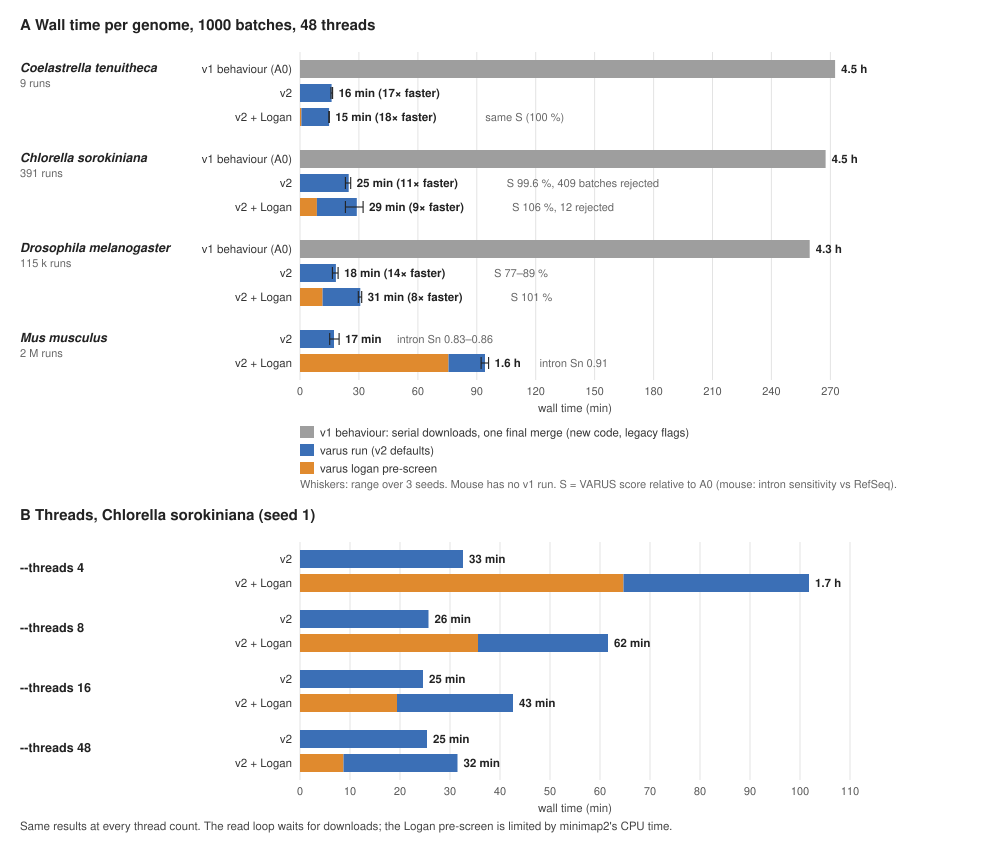

# pyVARUS speed-ups (v2)

pyVARUS is version 2 of VARUS. On the benchmark genomes, v2 needs 15–31 min
where v1's serial loop took 4.3–4.5 h. The Logan pre-screen adds time but raises the score or the
intron sensitivity:



Production runs spend about half of every batch waiting for `fastq-dump`'s
per-call latency, a quarter in HISAT2 and a quarter in Python bookkeeping
that used to grow with the number of introns seen. v2 removes the growth
(introns are stranded once and the splice-site DB is rewritten only when new
junctions appear), overlaps downloads with alignment, and moves the final
BAM merge into the background. The figure shows which parts run at the
same time (numbers from [`benchmark_logan.md`](benchmark_logan.md)):


```sh
varus run "Schizosaccharomyces pombe" genome.fa --runlist Sp/Runlist.tsv \
          --index Sp/genome/hisatidx --outdir Sp/ --threads 8
```

* `--parallel-downloads K` (default 6) keeps K downloads in flight. Each
  pick is made against the observed tile counts *plus* the expected
  contribution of the batches still downloading (lazy greedy), so K
  parallel picks are not blind repeats of the same run. `fastq-dump` on a
  remote spot range is latency-bound, so K=3 gave 2.7× and K=6 4× over
  serial downloads on the benchmark genomes, for about 2 % more rejected
  batches and 0.5 % of the score. With K=1, `--no-logan` and
  `--advanced lambda=10 pseudo-count=1` the pick sequence is that of v1.
* With `--parallel-downloads` > 1, HISAT2 on the next finished download runs in a
  background thread while the main thread scans, counts and scores the
  current batch. Picks are unchanged; the aligner may use a splice-site DB
  one batch older.
* `--threads` is a budget for everything that runs at once (see
  [Threads and machine size](#threads-and-machine-size)).
* Whole-run downloads with `prefetch` were tried and removed: they help
  only for genomes with a handful of runs, and with many runs they fill the
  local disk with `.sra` files of runs that are then rejected and keep
  downloading after the last batch
  ([`benchmark_logan.md`](benchmark_logan.md)).

## Threads and machine size

`--threads` is split between the stages that run at the same time. The
worker counts that cost CPU (`--scan-workers`, `--align-groups`) follow
it:

| `--threads` | `varus run`: HISAT2 `-p` (during a rolling merge) | scan workers | `varus logan`: minimap2 processes × threads | scanners |
|---|---|---|---|---|
| 4 | 3 (3) | 0 (main thread) | 1 × 3 | 2 |
| 8 | 6 (6) | 0 (main thread) | 1 × 6 | 2 |
| 16 | 13 (12) | 2 | 1 × 13 | 2 |
| 32 | 27 (24) | 4 | 2 × 14 | 2 |
| 48 | 43 (39) | 4 | 3 × 14 | 3 |
| 64 | 59 (55) | 4 | 4 × 14 | 4 |
| 256 | 251 (247) | 4 | 4 × 62 | 4 |

The table follows from these rules:

* **`varus run`.** The aligner gets `--threads` minus the scan workers (or
  the main thread) and minus one core for all `fastq-dump` processes. While
  a rolling merge runs, it also gives up the merge's `-@` (at most 4).
  `samtools sort -@` is at most 4.
* **`varus logan`.** minimap2 gets `--threads` minus the scanners and minus
  one core for the main and download threads.
* **Caps.** Reservations never take more than a quarter of `--threads`.
  Index builds and the final merge run alone and use all threads.
* An explicit `--scan-workers` or `--align-groups` overrides the automatic
  value.

### What limits a run

The numbers below are from *Chlorella sorokiniana* (GCA_025917655.1,
38.8 Mbp, 391 candidate runs, 1000 batches) unless stated otherwise
([`benchmark_logan.md`](benchmark_logan.md), "Thread scaling").

* **4–8 threads (laptop, small VM).** The Logan pre-screen dominates,
  because its minimap2 alignment is limited by CPU. The read loop barely
  slows down, because it waits for downloads (`--no-logan` takes 33 min at
  4 threads and 26 min at 8). The results are the same at every thread
  count. The scan stays in the main thread, and `varus logan` runs one
  minimap2 process, so only one copy of the index is in memory.
* **16–48 threads.** This is the configuration of the benchmarks. At 48
  threads the loop is limited by downloads on brain: the main thread waits
  for data for 7–10 of 19 min.
* **More than 48 threads.** The extra cores go to HISAT2 and minimap2. They
  do not make a run faster, because downloads are the limit. Running
  several genomes on one node does not get around this, because they share
  the same network connection. Logan's S3 gave ~8 MB/s in total with 8 or
  16 connections, so two Logan stages at once each get about half. For read
  downloads we measured up to 6 in flight, which scaled with the number of
  downloads (each `fastq-dump` call has a fixed cost of 5–27 s); where the
  connection fills up beyond that is not known.
* **Settings that do not depend on the core count.** `--parallel-downloads`
  (6), `--download-workers` (8) and `--merge-batches` (10) are limited by
  the network and by NCBI, not by CPUs. Raise them only after measuring on
  your own network; 6 downloads are the most we tested.
* **Memory.** HISAT2 maps its index once (`--mm`). Every minimap2 process in
  `varus logan` loads its own copy of the index, so the number of processes
  is also capped by memory: each needs the index size plus 2 GiB, within
  60 % of the available memory (the smaller of `MemAvailable` and the
  cgroup/SLURM limit). Mouse (10.8 GB index) runs 3 processes at 48
  threads in 66 GB. Pass `--align-groups 1` if the node is shared.
